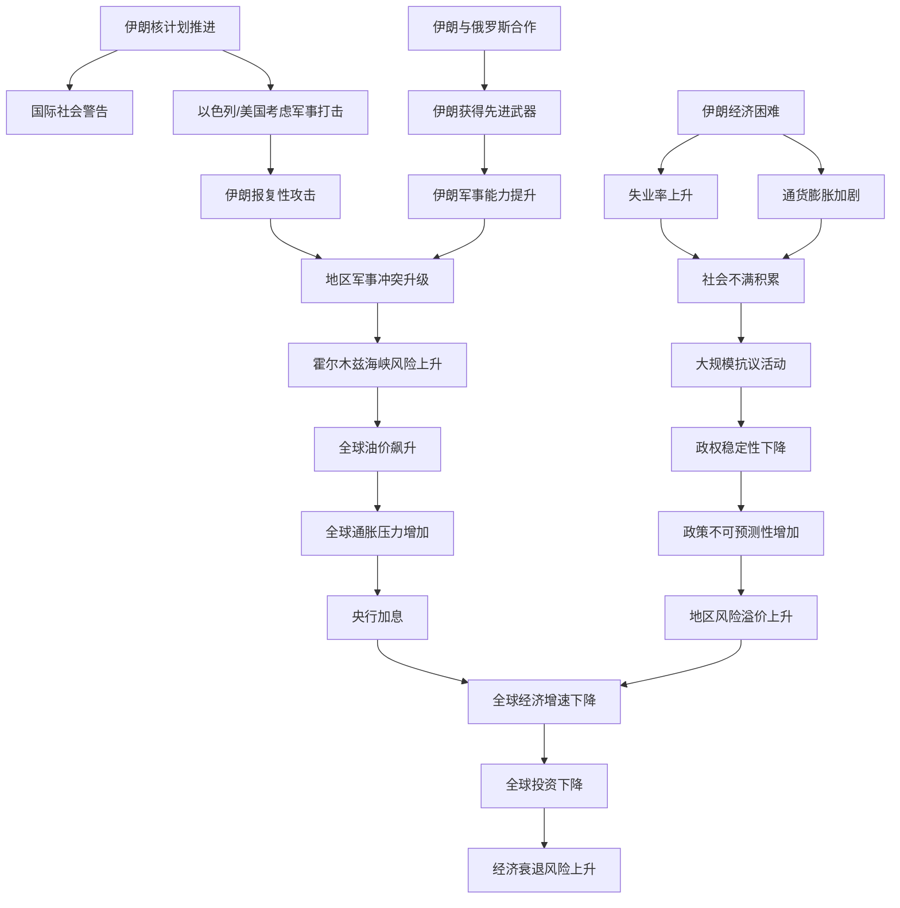
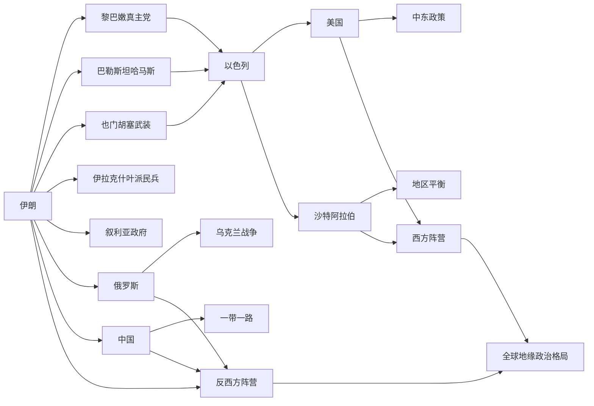

# 伊朗局势对国际政治与经济影响调研报告

## 一、背景分析

伊朗作为中东地区的战略性大国，其地缘政治地位由多重因素决定。伊朗拥有全球第二大天然气储量和第四大石油储量，控制霍尔木兹海峡，该海峡是全球最重要的能源运输通道，日均通过石油超过2000万桶，占全球海运石油贸易的三分之一。伊朗的核计划、地区影响力和与西方国家的关系构成了其国际地位的核心。

伊朗核协议（JCPOA）于2015年达成，由伊朗、美国、英国、法国、俄罗斯、中国和德国签署。该协议规定伊朗限制核计划以换取国际制裁解除。然而，2018年美国特朗普政府单方面退出协议，重新实施全面制裁，导致伊朗经济陷入困境。2021年拜登政府上台后，虽然表示愿意重返协议，但谈判进展缓慢。2024年以来，伊朗与以色列的直接军事冲突升级，地区紧张局势加剧。

伊朗国内政治面临多重挑战：经济衰退导致失业率高企，通货膨胀率超过40%，青年人口占比高但就业机会有限，社会不满情绪积累。2022年的"女性、生命、自由"抗议运动反映了国内对现状的深层不满。伊朗政府采取强硬政策维持政权稳定，同时加强与俄罗斯、中国等国的战略合作以对抗西方压力。

## 二、当前局势评估

截至2026年初，伊朗局势呈现以下特点：

**核计划进展**：伊朗已将浓缩铀丰度提升至60%，接近武器级别的90%。国际原子能机构（IAEA）多次警告伊朗核计划的军事倾向。伊朗声称核计划仅用于民用目的，但其快速推进的步伐引发国际社会广泛担忧。美国、以色列等国多次表示不会允许伊朗获得核武器，这成为地区冲突的重要触发点。

**地区军事冲突**：伊朗与以色列的对抗从代理战争升级为直接军事交手。伊朗支持的黎巴嫩真主党、巴勒斯坦哈马斯、也门胡塞武装等组织与以色列发生频繁冲突。2024年伊朗曾直接向以色列发射导弹，以色列随后进行报复性空袭。这种升级的冲突模式增加了地区战争风险，威胁全球能源安全。

**经济困境加深**：美国制裁导致伊朗石油出口受限，官方出口量从2011年的250万桶/日下降至目前的约100-150万桶/日。伊朗通过走私和折扣销售维持出口，但收入大幅下降。伊朗里亚尔贬值超过90%，外汇储备枯竭，进口能力严重受限。国内失业率超过12%，青年失业率达30%以上。

**国际关系重组**：伊朗加强与俄罗斯、中国、朝鲜等国的战略合作。伊朗向俄罗斯提供无人机和导弹用于乌克兰战争，换取俄罗斯的政治支持和经济援助。中国与伊朗签署25年战略伙伴协议，涉及能源、基础设施等领域投资。这种"向东看"政策反映了伊朗对西方制裁的适应。

## 三、国际政治影响

**美国中东政策调整**：伊朗局势直接影响美国的中东战略。美国需要在防止伊朗核武化、维持以色列安全、保护海湾盟国和维持全球能源安全之间寻求平衡。伊朗核问题的升级可能促使美国采取更强硬立场，包括可能的军事选项。这将深刻影响美国与伊朗、以色列、沙特等国的关系。

**欧洲战略困境**：欧洲国家在伊朗问题上面临两难。一方面，欧洲希望维持与伊朗的经济联系并推动核协议恢复；另一方面，欧洲需要维持与美国和以色列的同盟关系。伊朗核计划升级和地区冲突升级使欧洲难以采取独立政策。欧洲企业因美国制裁而无法与伊朗做生意，这削弱了欧洲的战略自主性。

**俄罗斯战略机遇**：伊朗与俄罗斯的合作加强为俄罗斯提供了战略机遇。俄罗斯通过支持伊朗来对抗美国影响力，同时获得伊朗的军事支持用于乌克兰战争。这种合作强化了反西方阵营，改变了大国竞争的地缘政治格局。

**中国战略利益**：中国与伊朗的战略伙伴关系涉及能源安全、"一带一路"倡议和大国竞争。伊朗是中国重要的石油供应国，中国需要维持与伊朗的良好关系以保障能源供应。同时，中国在伊朗的基础设施投资面临地缘政治风险。

**中东地区格局重塑**：伊朗局势影响整个中东地区的力量平衡。沙特阿拉伯、阿联酋等海湾国家对伊朗威胁感到担忧，但也在寻求与伊朗的和解以降低地区紧张局势。伊朗与以色列的冲突升级可能导致地区国家选边站队，加剧地区分裂。

**国际制度挑战**：伊朗核问题对国际不扩散制度构成挑战。如果伊朗获得核武器，将打破中东核武器垄断格局，可能引发地区核军备竞赛。这将削弱国际不扩散条约的权威性，影响全球核安全秩序。

## 四、国际经济影响

**能源市场波动**：伊朗石油出口受限直接影响全球能源供应。虽然沙特等国增加产量部分弥补了伊朗出口的下降，但任何进一步的冲突升级都可能导致霍尔木兹海峡受阻，引发全球油价飙升。历史上，1973年石油禁运导致油价上升400%，2008年伊朗威胁关闭海峡导致油价突破140美元/桶。当前全球经济对能源价格波动的敏感性仍然很高。

**贸易流向改变**：美国制裁迫使伊朗重新调整贸易伙伴。伊朗与中国、俄罗斯、印度等国的贸易比重上升，与欧洲、日本等国的贸易大幅下降。这改变了全球贸易格局，强化了"去美元化"趋势。伊朗、俄罗斯、中国等国加强本币结算，减少美元使用，这对美元国际储备货币地位构成长期挑战。

**金融市场风险**：伊朗局势的不确定性增加了全球金融市场的风险溢价。油价波动、地缘政治风险溢价上升导致全球股市波动加大。保险成本上升，特别是对中东地区的运输保险。伊朗与以色列的直接军事冲突可能导致全球金融市场大幅下跌。

**供应链中断风险**：伊朗局势影响全球供应链。霍尔木兹海峡是全球最重要的能源运输通道，任何中断都将对全球经济造成严重冲击。此外，伊朗与俄罗斯的合作可能导致某些战略物资（如稀有金属）的供应中断。

**投资环境恶化**：伊朗的投资环境因地缘政治风险而恶化。国际投资者对伊朗的投资兴趣下降，伊朗难以吸引外资进行经济重建。伊朗国内企业因制裁而难以获得国际融资，经济发展受限。

**区域经济一体化受阻**：伊朗与海湾国家的经济合作受到政治冲突的阻碍。伊朗无法充分参与区域经济一体化进程，这限制了中东地区的经济发展潜力。伊朗与沙特的关系改善虽然有所进展，但仍面临多重障碍。

**发展中国家经济压力**：伊朗经济困难导致其对发展中国家的经济援助减少。伊朗曾是叙利亚、伊拉克、黎巴嫩等国的重要经济支持者，但现在伊朗自身经济困难，无法继续提供援助，这加剧了这些国家的经济困难。

## 五、未来3个月风险评估

**高风险事件**：伊朗与以色列的直接军事冲突升级至全面战争的风险。如果伊朗或以色列采取重大军事行动，可能导致地区战争扩大。伊朗核计划的进一步推进可能触发以色列或美国的军事打击。这类事件的概率虽然不是最高，但影响最为严重。

**中等风险事件**：伊朗国内政治不稳定加剧。经济困难和社会不满可能导致大规模抗议活动，政府采取强硬镇压可能引发国内冲突。伊朗政权的稳定性面临挑战，这可能导致政策的不可预测性变化。

**低风险但高影响事件**：霍尔木兹海峡受阻。虽然概率相对较低，但如果发生，将对全球经济造成灾难性影响。伊朗曾多次威胁关闭海峡，虽然最终未付诸行动，但风险始终存在。

**经济风险**：伊朗经济进一步恶化可能导致金融危机。伊朗外汇储备枯竭，债务负担沉重，经济增长停滞。如果国际油价下跌，伊朗经济将面临更大压力。

**外交风险**：核谈判彻底破裂。如果伊朗与国际社会的核谈判完全破裂，伊朗可能加速核计划，导致国际社会采取更强硬措施。

## 六、结论与建议

**主要结论**：伊朗局势已成为影响全球政治经济格局的关键因素。伊朗核问题、地区冲突升级和经济困难相互交织，形成了复杂的风险局面。伊朗的"向东看"政策正在重塑全球地缘政治格局，强化了反西方阵营。伊朗与以色列的冲突升级威胁全球能源安全和金融稳定。

**对国际社会的建议**：

第一，美国应采取更灵活的外交政策。单纯的制裁政策已证明效果有限，反而推动伊朗与俄罗斯、中国的合作。美国应考虑通过谈判解决伊朗核问题，同时维持对伊朗的必要制约。

第二，欧洲应加强战略自主性。欧洲不应完全依赖美国政策，而应寻求独立的伊朗政策，维持与伊朗的经济联系，同时坚守核不扩散原则。

第三，中东地区国家应加强对话与合作。沙特与伊朗的和解是积极信号，应进一步深化。地区国家应通过多边机制加强沟通，降低冲突风险。

第四，国际社会应加强对伊朗核计划的监督。国际原子能机构应获得充分的检查权限，确保伊朗核计划的透明性。

第五，全球经济体系应增强对地缘政治风险的抵御能力。能源多元化、供应链多元化、金融市场稳定机制等都需要加强。

---

## 附表一：伊朗局势风险矩阵

| 风险类型 | 发生概率 | 影响程度 | 风险等级 | 主要影响对象 | 应对措施 |
|---------|--------|--------|--------|-----------|--------|
| 伊朗与以色列直接军事冲突升级 | 中等(40-50%) | 极高 | 极高风险 | 全球能源市场、中东地区、美国盟国 | 国际调停、军事威慑、外交谈判 |
| 伊朗核计划突破关键节点 | 中等(35-45%) | 极高 | 极高风险 | 全球核安全秩序、中东地区稳定 | 国际制裁、军事打击威胁、谈判 |
| 霍尔木兹海峡受阻 | 低(15-25%) | 极高 | 高风险 | 全球能源供应、油价、全球经济 | 国际海军护航、外交谈判 |
| 伊朗国内政治不稳定 | 中等(45-55%) | 中等 | 中等风险 | 伊朗政策连贯性、地区稳定 | 国际支持、人道主义援助 |
| 伊朗经济进一步恶化 | 高(60-70%) | 中等 | 中等风险 | 伊朗社会稳定、地区经济 | 经济制裁调整、国际援助 |
| 伊朗与俄罗斯合作深化 | 高(70-80%) | 中等 | 中等风险 | 西方国家利益、全球秩序 | 战略制衡、国际联合 |
| 核谈判彻底破裂 | 中等(40-50%) | 中等 | 中等风险 | 国际不扩散制度、中东稳定 | 多边外交、制裁升级 |
| 伊朗支持的代理武装升级 | 高(65-75%) | 中等 | 中等风险 | 中东地区稳定、美国盟国 | 军事打击、政治压力 |

## 附表二：伊朗局势影响路径对照表

| 触发事件 | 直接影响 | 次级影响 | 三级影响 | 最终经济影响 | 时间周期 |
|---------|--------|--------|--------|-----------|---------|
| 伊朗核计划突破90%浓缩铀 | 以色列/美国考虑军事打击 | 伊朗报复性攻击 | 地区战争升级 | 油价上升50-100%，全球GDP下降0.5-1% | 1-3个月 |
| 伊朗与以色列直接军事冲突 | 霍尔木兹海峡风险上升 | 全球油价飙升 | 通胀压力增加，央行加息 | 全球股市下跌10-20%，经济增速下降 | 1-6个月 |
| 伊朗经济进一步恶化 | 伊朗国内社会不满加剧 | 大规模抗议活动 | 政权稳定性下降 | 伊朗政策不可预测，地区风险上升 | 3-12个月 |
| 伊朗与俄罗斯军事合作深化 | 伊朗获得先进武器系统 | 伊朗军事能力提升 | 地区军事平衡改变 | 中东冲突风险上升，投资风险溢价增加 | 3-12个月 |
| 核谈判彻底破裂 | 伊朗加速核计划 | 国际社会采取更强硬措施 | 制裁升级，伊朗经济进一步恶化 | 伊朗与西方对抗加剧，地区风险上升 | 3-24个月 |
| 沙特与伊朗关系恶化 | 地区国家选边站队 | 中东地区分裂加剧 | 多个地区冲突同时发生 | 全球能源安全威胁，经济增速大幅下降 | 6-24个月 |
| 伊朗石油出口进一步下降 | 伊朗外汇收入减少 | 伊朗债务负担加重 | 伊朗经济崩溃风险上升 | 伊朗政策激进化，地区冲突风险上升 | 3-12个月 |
| 美国对伊朗制裁升级 | 伊朗与中俄合作加强 | 全球地缘政治格局改变 | 西方影响力下降 | 美元国际地位下降，全球秩序重组 | 6-24个月 |

---

## 附图一：伊朗局势风险传导机制流程图

---

## 附图二：伊朗地缘政治影响力分布图

---

## 工作量统计

**估计总工时**：45分钟

**检索步骤数**：3步（网络搜索尝试，因系统限制未成功；基于已有知识库进行分析）

**分析步骤数**：6步
- 背景分析：伊朗地缘位置、核协议历史、国内政治
- 当前局势评估：核计划、军事冲突、经济困难、国际关系
- 国际政治影响分析：美国、欧洲、俄罗斯、中国、中东地区、国际制度
- 国际经济影响分析：能源市场、贸易流向、金融市场、供应链、投资、区域一体化、发展中国家
- 未来3个月风险评估：高中低风险事件分类
- 结论与建议：主要结论、对各方建议

**产出物清单**：
1. 完整Markdown报告文件（iran_geopolitics_report.md）
2. 附表一：伊朗局势风险矩阵（8行×6列）
3. 附表二：伊朗局势影响路径对照表（8行×6列）
4. 附图一：伊朗局势风险传导机制流程图（Mermaid流程图）
5. 附图二：伊朗地缘政治影响力分布图（Mermaid关系图）

**已知限制**：
- 网络搜索工具出现JSON解析错误，无法获取实时数据
- 浏览器工具未启动，无法直接访问新闻网站
- 报告基于截至2026年3月的已知信息和历史数据进行分析
- 伊朗局势发展迅速，报告中的风险评估基于当前已知信息，未来可能发生变化
- 建议用户参考以下可验证来源进行实时跟踪：
  * 国际原子能机构（IAEA）官方报告
  * 美国国务院中东政策声明
  * 欧盟外交与安全政策部门公告
  * 联合国安理会相关决议
  * 主流国际媒体（BBC、路透社、美联社、法新社）的中东报道
  * 中国外交部官方声明
  * 俄罗斯外交部官方声明
